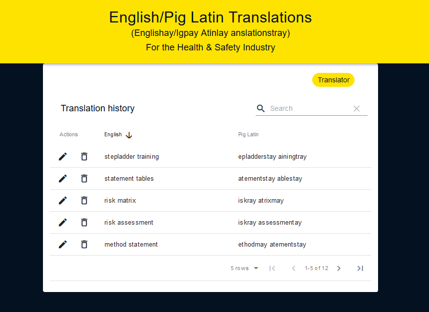

[](https://circleci.com/gh/olliebrownlow/pig-latin-react-frontend)

# English to Pig Latin translation service (frontend)

Single-page, web app with CRUD functionality created using a React.js frontend and [rails backend](https://github.com/olliebrownlow/pig-latin-rails-backend). On the translator view the app allows a user to translate into Pig Latin any phrase they wish. A button takes the user to a history of their translations where they can delete and update individual entries as well as sort and search through them.

### Deployment on Heroku

Go [here](https://piglatin-dictionary.herokuapp.com/).

### Getting started

Clone the repo, navigate to the root directory and run `npm install` to install the dependencies. Run `npm start` to start it in development mode (localhost:3000). The rails backend needs to be started on a different port.

The backend is available [here](https://github.com/olliebrownlow/pig-latin-rails-backend) and needs setting up first.

### Tech stack

- Ruby on Rails 6.0.0
- React.js 16.10.1
- Jest 24.9.0
- React-Testing-Library 9.5.0
- Cypress 3.1.3
- Axios 0.19.0
- PostgreSQL 10

### Page design

For this I have used material-ui with styling tweaks here and there, as well as material-table for the historical list of translations.

### Code design

The interactive components are accessed through a wrapper component (Controller.js) which has a `step` counter which renders the correct 'page' depending on user navigation.

Requests to the rails backend server are made using axios and interact with a PostgreSQL database.

Most state is saved to the parent component for easy access from the child components. Some more "local" state is kept in the child components - snackbar alerts and table column naming information.

As a user inputs a term to translate, the term is saved to state in the parent component. On clicking "submit" (see [edge cases section](#edge-cases) for when user leaves the text field empty or uses capital or non-letter characters), a post request is made and the response is filtered for the translation which is displayed. The input field's entry is preserved, even when navigating away, for a better UX.

The translation history page displays all records held in the database. PUT and DELETE requests are made from here via the action icons, and there is a button for returning to the translator page.

### User stories

```
As a user,
so I can produce documents in Pig Latin,
I want to be able to translate English terminology into Pig Latin.
```

```
As a user,
to avoid repeatedly translating the same terminology,
I want to be able to see all of my translated terminology.
```

```
As a user,
so as not to clutter the page showing my translation history,
I don't want to be able to save one term multiple times or in multiple forms.
```

#### Extra user stories

```
As a user,
in case I no longer need outdated terminology,
I want to be able to delete any translated terminology I have saved.
```

```
As a user,
in case I save an incorrect term,
I want to be able to update any terminology I have saved.
```

```
As a user,
in order to quickly locate a particular term,
I want to be able to search through my saved terminology.
```

### Edge cases

## Submitting new translations

- If the user leaves the TranslatorView textfield blank and clicks "submit" a snackbar message pops up asking the user to enter text.

- If the user inputs any characters that are not letters, they are ignored by the `handleChange()` method. Capitla letters are converted to lower-case and all letters are saved to state and ready for translation.

## Editing old Translations

- If the user leaves the DictionaryView edit field blank and clicks the "save" tick, a snackbar message pops up informing the user that the field cannot be left empty.

- If the user inputs any characters that are not lower-case letters, they are filtered out by the `handleEdit()` method with only the lower-case letters pushed to the back end.

- If the user tries to edit a translation by inputting a term that is already in the history list, a snackbar message pops up informing the user that the term is already there and can be searched for.

### Screenshots

Translation page


Translation history page


Delete function


Update function

